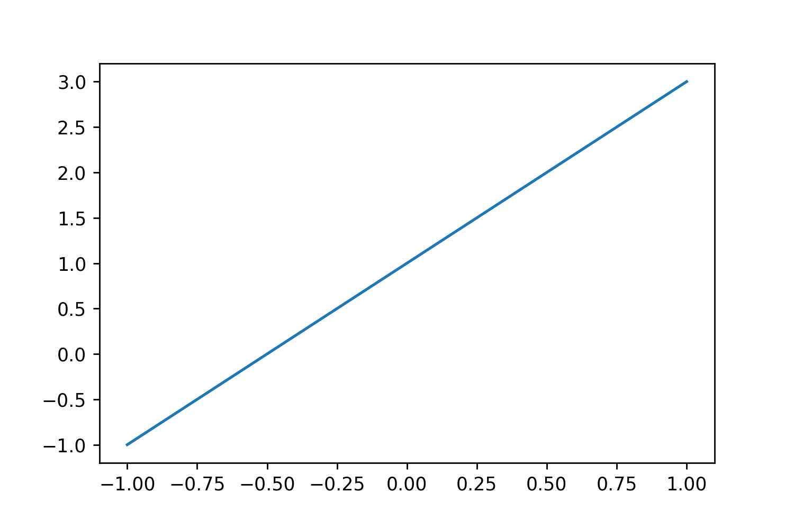

# matplotlibTutorial

| [plt1_simple_plot]() |  |
| :------------------- | :----------------------------------------------------------: |
|                      |                                                              |
|                      |                                                              |
|                      |                                                              |

